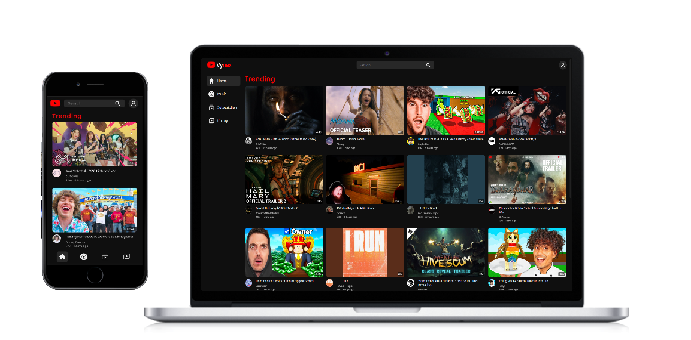

[](https://vynex-self.vercel.app)

# Vynex | The Modern Video & Streaming Platform
##### Created : 17/11/2025

A YouTube-style app built with React. Search, browse trending and music videos, save stuff to your library, and watch with related recommendations — all powered by the YouTube API.

### Preview



## Tech Stack

<div align="center">
  
  
  
  
  
</div>

## Features

- Search and channel pages
- Trending home feed and music section
- Video player with related videos
- Library saved in localStorage
- Responsive layout

## Getting started

```bash
git clone https://github.com/beoipisilon/vynex.git
cd vynex
npm install
```

Create a `.env` in the project root:

```
REACT_APP_YT_API=your_youtube_api_key
```

Then:

```bash
npm start
```

For Vercel, set `YT_API_KEY` (or `REACT_APP_YT_API`) in the project environment variables.
